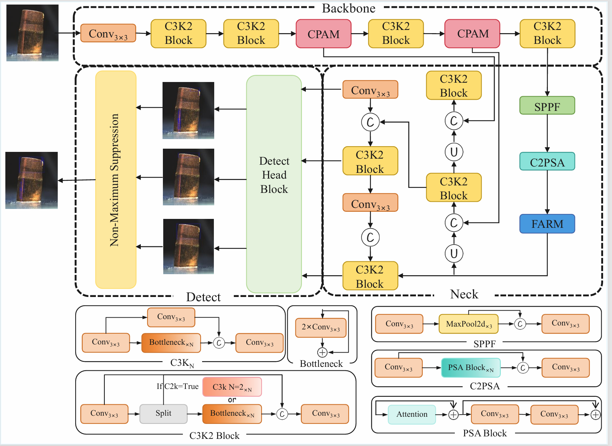

# CF-YOLO: A Context-Aware and Feature-Refined Architecture for Camouflaged Anomalies


**Context-Aware** | **Feature-Refined** | **Camouflaged Anomaly Detection**

</div>

## 📖 Introduction

This is the official implementation of the paper: **"CF-YOLO: A Context-Aware and Feature-Refined Architecture for Camouflaged Anomalies"**.

**CF-YOLO** is a novel real-time detection framework specifically designed for **industrial surface defect detection** (e.g., copper tubes), where anomalies are often minute and visually camouflaged against complex backgrounds. 

To tackle the challenges of weak feature representations and high false positive rates, our method integrates two key innovations into the YOLO baseline:

1.  **Context-Perception Aggregation Module (CPAM):** Synergises large-kernel perception for macro-texture context with small-kernel aggregation for sharp boundary delineation, effectively breaking background camouflage.
2.  **Feature Additive Refinement Module (FARM):** Employs a linear-complexity additive token mixer to globally verify and refine fine-grained anomaly representations, suppressing noise-induced errors.

Additionally, we introduce the **Copper Tube Defect Dataset (CTDD)**, a large-scale annotated benchmark to support research in this domain. Extensive experiments on CTDD demonstrate that CF-YOLO surpasses strong baselines like **YOLOv11**, achieving improvements of **2.2% in mAP@50** and **3.9% in Precision**, while maintaining real-time inference speed.

<div align="center">
  
  <br>
  <em>Figure 1: The overall architecture of CF-YOLO.</em>
</div>

## 🔥 News
- **[2026-02-07]** The training and inference codes are released!

## ✨ Features

- **Context-Perception Aggregation (CPAM):** Synergises large-kernel perception for macro-texture context and small-kernel aggregation for sharp boundary delineation, effectively breaking background camouflage.
- **Feature Additive Refinement (FARM):** Employs a linear-complexity additive token mixer to globally verify and refine fine-grained anomalies, suppressing noise-induced errors.
- **Industrial-Grade Performance:** specifically optimized for surface micro-defects (e.g., copper tubes), surpassing YOLOv11 by **2.2%** in mAP@50 and **3.9%** in Precision.
- **Real-Time Efficiency:** Maintains the high inference speed characteristic of the YOLO family, making it suitable for online industrial inspection.
- **New Benchmark (CTDD):** Introduces the **Copper Tube Defect Dataset**, a large-scale annotated benchmark for camouflaged anomaly detection research.

## 🛠️ Installation

### Requirements
- Linux (Ubuntu 18.04/20.04 recommended)
- Python >= 3.10
- PyTorch >= 2.1.0
- CUDA >= 11.1

## 📊 Results

We compare our CF-YOLO with state-of-the-art methods on camouflaged anomaly detection benchmarks.

| Model | P | AP<sub>50</sub> | AP<sub>95</sub> | AP<sub>75</sub> | mIoU | F<sub>1</sub> | F<sub>0.5</sub> | Avg |
| :--- | :---: | :---: | :---: | :---: | :---: | :---: | :---: | :---: |
| Cascade R-CNN [24] | 0.594 | 0.732 | 0.479 | 0.334 | 0.755 | 0.661 | 0.619 | 0.596 |
| Faster R-CNN [23] | 0.500 | 0.746 | 0.471 | 0.265 | 0.613 | 0.537 | 0.737 | 0.553 |
| CenterNet [37] | 0.853 | 0.667 | 0.404 | 0.221 | 0.753 | 0.720 | 0.798 | 0.631 |
| ATSS [38] | 0.832 | 0.483 | 0.402 | 0.081 | 0.706 | 0.638 | 0.471 | 0.516 |
| RetinaNet [26] | 0.448 | 0.684 | 0.445 | 0.152 | 0.704 | 0.568 | 0.489 | 0.499 |
| Dynamic R-CNN [39] | 0.547 | 0.695 | 0.450 | 0.259 | 0.731 | 0.644 | 0.582 | 0.558 |
| FoveaNet [40] | 0.479 | 0.659 | 0.428 | 0.131 | 0.705 | 0.577 | 0.514 | 0.499 |
| ETDNet [34] | 0.675 | 0.788 | **0.560** | 0.411 | 0.775 | 0.653 | 0.666 | 0.647 |
| Conditional DETR [41]| 0.546 | 0.582 | 0.268 | 0.291 | 0.663 | 0.600 | 0.566 | 0.476 |
| YOLOv11 [42] | 0.843 | 0.801 | 0.464 | 0.429 | **0.780** | 0.771 | 0.806 | 0.699 |
| **CF-YOLO (Ours)** | **0.882** | **0.823** | 0.488 | **0.455** | 0.769 | **0.796** | **0.846** | **0.723** |

*Note: Best results are highlighted in **bold**. Our model achieves the best performance in most metrics.*

### Step-by-step
```bash
# Clone the repository
git clone https://github.com/Yu-Xinda/CF-YOLO-A-Context-Aware-and-Feature-Refined-Architecture-for-Camouflaged-Anomalies.git
cd CF-YOLO-A-Context-Aware-and-Feature-Refined-Architecture-for-Camouflaged-Anomalies

# Create a virtual environment (Recommended)
conda create -n cfyolo python=3.10 -y
conda activate cfyolo

# Install dependencies
pip install -r requirements.txt
```

📂 Data Preparation
Please organize your dataset (e.g., CTDD) as follows:

```
data/
├── CTDD/
│   ├── train/
│   │   ├── images/
│   │   └── labels/
│   └── val/
│       ├── images/
│       └── labels/
└── ...
```

Training
To train the CF-YOLO model, simply run the following command:

```bash
python train.py
```
Note: You can modify the training configurations (e.g., batch size, epochs, data path) directly inside train.py or configs/ if needed.

Testing
To evaluate the trained model on the test set, run:

```bash
python test.py
```
🙏 Acknowledgement
We sincerely appreciate the authors of [Ultralytics](https://github.com/ultralytics/ultralytics) YOLO for their excellent open-source work, which serves as the strong baseline for our project.
